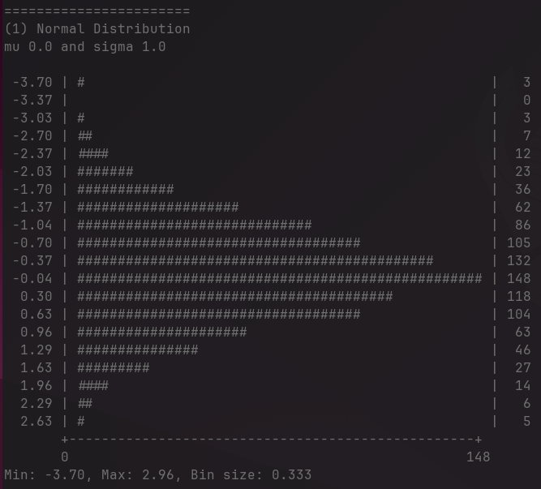
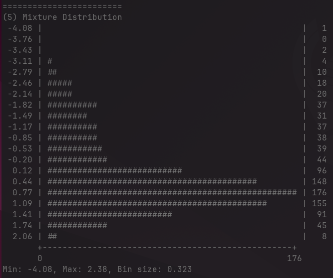

# Terminal Distribution Visualization

This portfolio sort of program simply visualizes a number of different 
distributions in the terminal.

It does this by taking draws from the distributions and building a histogram.

The histogram is sort of animated so it doesn't draw in the blink of an eye.

## PyMC

There are a few different methods one could use to sample these distributions.

PyMC is used because of the number of distributions supported and the fact that 
you can build models using the distributions and also sample from the priors or posterior distributions.
